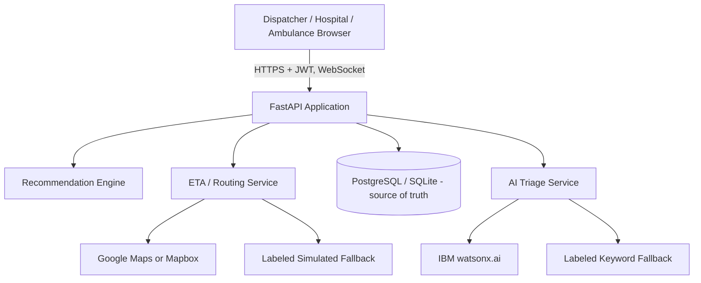

# Architecture

## System Architecture

There is no application state held in the FastAPI process itself beyond the live websocket connection list (real-time delivery only). Every read and write goes through the database.

## Components

| Component | Technology | Responsibility |
|---|---|---|
| Frontend | Static HTML/CSS/JS, one page per portal | login, dispatcher, hospital, ambulance - real API calls, real GPS |
| Backend API | FastAPI, Uvicorn | REST endpoints, JWT auth/RBAC, WebSocket event broadcast |
| ORM / migrations | SQLAlchemy models (`models.py`), Alembic (`alembic/`) | Schema is the single source of truth, migrated not hand-created |
| Recommendation engine | Python (`recommendation_engine.py`) | Hard constraint filtering, weighted scoring, per-candidate explanations - unchanged from the original prototype design |
| Reservation service | Python (`reservation_service.py`) | Atomic conditional-UPDATE capacity reservations (no read-then-write race) |
| ETA / routing service | Python, Google Maps or Mapbox, labeled fallback | Travel-time estimates and road-route geometry |
| AI triage service | Python, IBM watsonx.ai, labeled keyword fallback | Condition classification + hospital handover notes - decision support, not diagnosis |
| Database | PostgreSQL (production) / SQLite (local dev) | Users, hospitals, emergencies, ambulances, trips, reservations, notifications, audit events |

## Data Flow (end to end)

1. A dispatcher creates an emergency (`POST /api/emergencies`) - AI-assisted triage runs synchronously and is stored as an auditable `AiDecision`.
2. `GET /api/emergencies/{id}/recommendation` builds live hospital data (`hospital_service.py`, only `VERIFIED`/active hospitals), fetches real ETA per candidate, and runs it through the unchanged recommendation engine.
3. The dispatcher requests a hospital (`POST /api/hospital-requests`); that hospital's own admin accepts (`reservation_service.reserve()` - transactional) or declines.
4. The dispatcher dispatches an available ambulance (`POST /api/trips`); the assigned operator starts the trip and streams real GPS (`POST /api/ambulances/{id}/location`, restricted to that operator).
5. A dynamic reroute reserves the new hospital's capacity before releasing the old one, so there is never a window with no reservation held.
6. Every state-changing step writes an `AuditEvent` and broadcasts a websocket event; the database remains authoritative regardless of what any connected client currently has cached.
7. `GET /api/analytics` computes metrics live from the same tables - no separate analytics store.

## Security Considerations

- No shared-secret auth anywhere - every `/api/*` route except `/api/auth/register`, `/api/auth/login`, and `/api/health` requires a valid JWT, checked server-side via `require_role()`/`get_current_user()`.
- Passwords are bcrypt-hashed; secrets are read from environment variables and excluded from git (see `.env.example`).
- `ALLOWED_ORIGINS` should be restricted to the real frontend origin(s) in production.
- Rate limiting (per-IP, configurable) and structured logging are on by default.
- Hospital/ambulance-scoped data access is enforced in the API (a hospital only sees emergencies routed to it; an ambulance operator only sees their own assigned trip) - see `emergency_routes.py`'s `_can_view_emergency()`.
- All hospital/patient data in this repository's seed script is fictional test data, clearly labeled "Test ..." - see `scripts/seed_development.py`.

## Scalability Notes

The app holds no in-process state beyond the websocket connection list, so it is safe to run multiple instances behind a load balancer as-is, *except*: (1) `ratelimit.py`'s per-IP counters are in-memory per process (move to Redis for multi-instance rate limiting), and (2) the websocket is a single shared broadcast channel per instance (a client connected to instance A won't see a broadcast triggered on instance B) - a real multi-instance deployment needs a shared pub/sub (e.g. Redis) fanning out broadcasts across instances.
