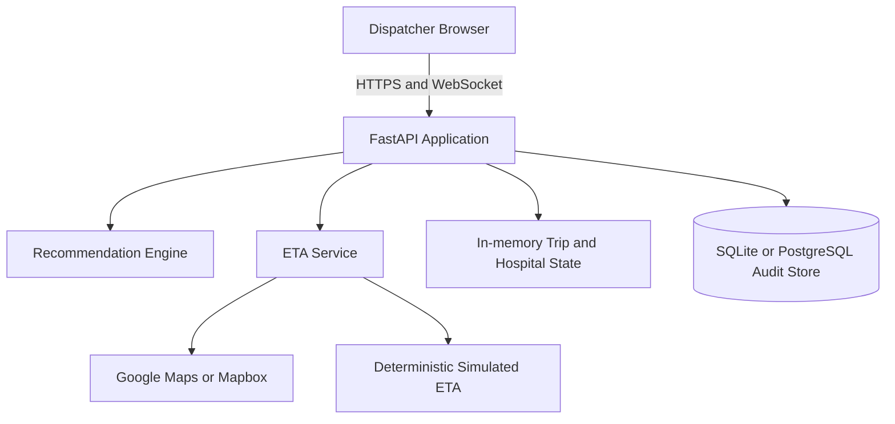

# Architecture

## System Architecture

## Components

| Component | Technology | Responsibility |
|---|---|---|
| Frontend | Static HTML, CSS, JavaScript, Leaflet | Map, dispatch controls, hospital view, analytics |
| Backend API | FastAPI and Uvicorn | REST endpoints, WebSocket events, lifecycle orchestration |
| Recommendation engine | Python | Clinical constraint filtering, weighted scoring, explanations |
| ETA service | Python, Google Maps or Mapbox, fallback simulator | Travel-time estimates with stable demo fallback |
| Live state | Python process memory | Active trips, reservations, hospital capacity, WebSocket broadcasts |
| Audit database | SQLAlchemy with SQLite or PostgreSQL | Trip history, events, and analytics persistence |

## Data Flow

1. The browser creates a trip through the REST API.
2. The API loads scenario, hospital, and severity-rule data.
3. The recommendation engine filters and scores hospitals.
4. The browser renders the recommendation and comparison table.
5. Accepting a destination mutates the locked shared state and writes an audit event.
6. The trip loop broadcasts position, trip, and reroute updates over WebSocket.
7. Analytics queries read persisted audit data.

## Security Considerations

- Secrets are read from environment variables and excluded from git.
- `APP_ACCESS_TOKEN` can protect API and WebSocket access.
- `ALLOWED_ORIGINS` should be restricted to the Vercel origin in production.
- Rate limiting and structured logging are configurable.
- The prototype uses fictional hospital data and must not be connected to real patient data without a full security and privacy review.

## Scalability Notes

The current process lock makes demo state updates consistent within one instance. A production deployment should move live trip state and broadcasts to shared infrastructure, use a managed PostgreSQL database, and integrate with hospital information systems before horizontal scaling.
