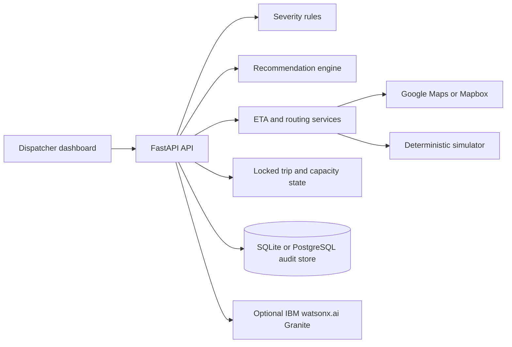

# AI Ambulance-to-Hospital Coordinator

## Slide 1: Title

**SrijanX | AI track**

An explainable emergency-dispatch coordinator that chooses the hospital where a patient can reach appropriate treatment fastest, not simply the nearest hospital.

Team lead: Shaunak Patel

## Slide 2: Problem

- Dispatchers make destination decisions under severe time pressure.
- Distance alone ignores ICU/ED capacity, specialist coverage, treatment time, and traffic.
- Manual calls and disconnected dashboards make capacity conflicts and rerouting hard to see.
- A wrong destination delays treatment and consumes scarce capacity.

## Slide 3: Solution

The coordinator turns one dispatch condition and current hospital state into an explainable decision:

1. Apply hard clinical and capacity constraints.
2. Estimate travel and treatment time.
3. Rank viable hospitals with a weighted score.
4. Show the recommendation and rejection reasons.
5. Reserve capacity, pre-alert the hospital, and monitor the trip.

## Slide 4: Architecture

## Slide 5: Demo Flow

- Select the suspected condition.
- Assess and inspect the top recommendation.
- Expand the hospital reasoning to see rejected constraints.
- Accept the destination and watch the reservation and pre-alert update.
- Launch a second ambulance to demonstrate shared capacity.
- Use Hospital View and Analytics to inspect operational state.

## Slide 6: IBM Technology Integration

- AI Triage Assist sends a dispatcher note to IBM watsonx.ai Granite when configured.
- The model suggests a condition code; it does not make the clinical decision.
- watsonx.ai can generate a concise hospital handover note.
- Missing credentials or provider failure produces a visible keyword/template fallback, so the demo remains reproducible.

## Slide 7: Impact and Safety

- Optimizes time to treatment rather than distance.
- Makes every recommendation inspectable.
- Treats hospital capacity as a shared resource across simultaneous ambulances.
- Preserves an audit trail for reservations, alerts, reroutes, and outcomes.
- Prototype data is fictional; production use requires clinical validation, hospital-system integration, privacy review, and shared durable live state.

## Slide 8: Team and Next Steps

**SrijanX**

- Shaunak Patel: team lead
- Abhi Patel
- Moon Shah
- Dhruvil Shah

Next steps:

- Connect hospital information systems and verified traffic feeds.
- Move live trip state and WebSocket fan-out to shared infrastructure.
- Add role-based access, observability, and clinical governance.
